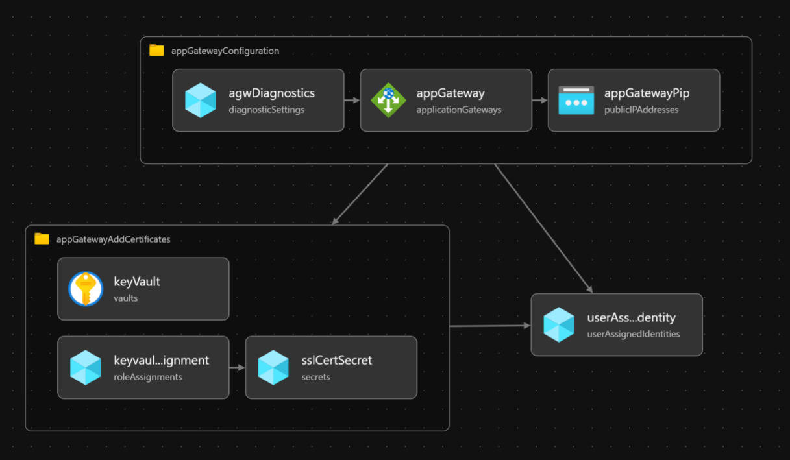
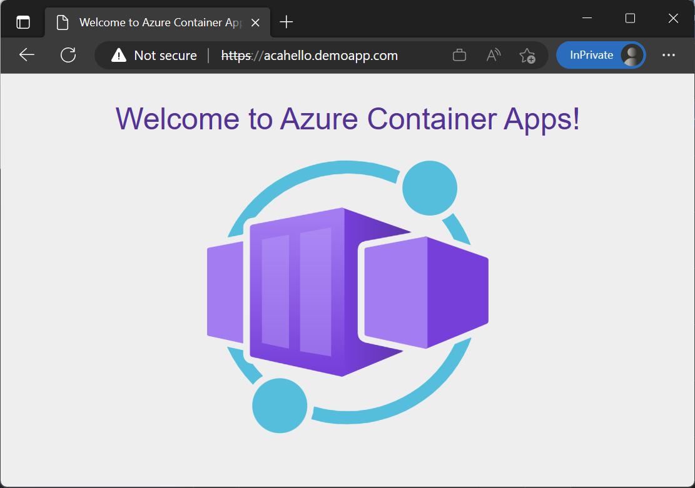

# Expose the workload through Application Gateway

The [workload that was deployed](../05-hello-world-sample-app/README.md) in the prior step needs to be exposed through a controlled gateway to reachable. Here, you'll deploy and configure Azure Application Gateway to serve that role.

## Expected results

The "Hello World" container app is exposed through Application Gateway, including with a TLS certificate that is stored in Key Vault. The cert is pre-generated.



### Resources

- Application Gateway with public IP
- SSL Certificate in Key Vault of the supporting services
- User Assigned Managed Identity for Application Gateway to access the secret in the Key Vault

#### Configure Terraform remote state

To configure your Terraform deployment to use the newly provisioned storage account and container, edit the [`./providers.tf`](./providers.tf) file at lines 11-13 as below:

```hcl
  backend "azurerm" {
    resource_group_name  = "<REPLACE with $RESOURCE_GROUP_NAME>"
    storage_account_name = "<REPLACE with $STORAGE_ACCOUNT_NAME>"
    container_name       = "tfstate"
    key                  = "myapp/container-apps-environment.tfstate"
  }
```

* `resource_group_name`: Name of the Azure Resource Group that the storage account resides in.
* `storage_account_name`: Name of the Azure Storage Account to be used to hold remote state.
* `container_name`: Name of the Azure Storage Account Blob Container to store remote state.
* `key`: Path and filename for the remote state file to be placed in the Storage Account Container. If the state file does not exist in this path, Terraform will automatically generate one for you.
  
## Steps

1. Navigate to the Terraform module for the Application Gateway configuration.
   
   ```bash
   cd ../06-application-gateway
   ```

1. Deploy and configure Application Gateway with TLS
   ```bash
   terraform init
   terraform plan -out tfplan
   terraform apply tfplan 
   ```
1. Get the public IP of Application Gateway.

   ```bash
   IP_APPGW=$(az deployment group show -g rg-lzaaca-spoke-dev-eus2 -n acalza01-appgw --query properties.outputs.applicationGatewayPublicIp.value -o tsv)
   echo $IP_APPGW
   ```

1. Add a host file entry. *Optional.*

   Application gateway was configured to use a TLS certificate on it's listener.  For the best experience we recommend you add a host file entry to facilitate a more realistic experience.

   `<IP_APPGW from prior step>    acahello.demoapp.com`

1. Access the "Hello World" application running in Azure Container Apps.

   Using your browser either navigate to **https://\<IP_APPGW from prior step>** from above, or if you added the host file entry, to **<https://acahello.demoapp.com>**. *Because the cert is self-signed for this walkthrough, you will need to accept the security warnings presented by your browser.*

   **Never use this certificate in production.**

   

## Next step

:broom: When you are done exploring the reference implementation, be sure to [clean up your resources](../../README.md#broom-clean-up-resources) to ensure you don't spend more than necessary.

